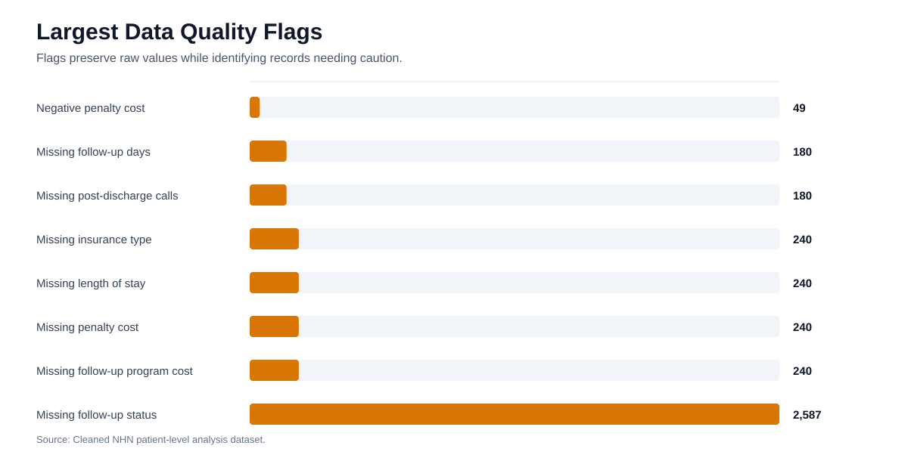
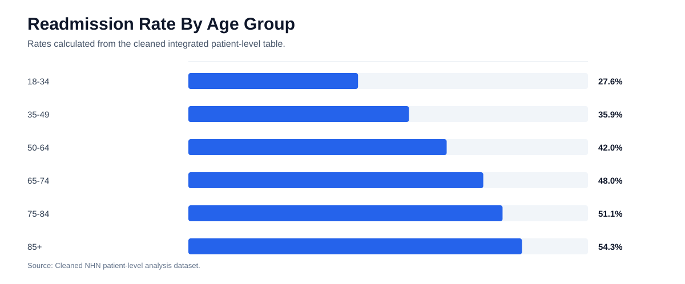
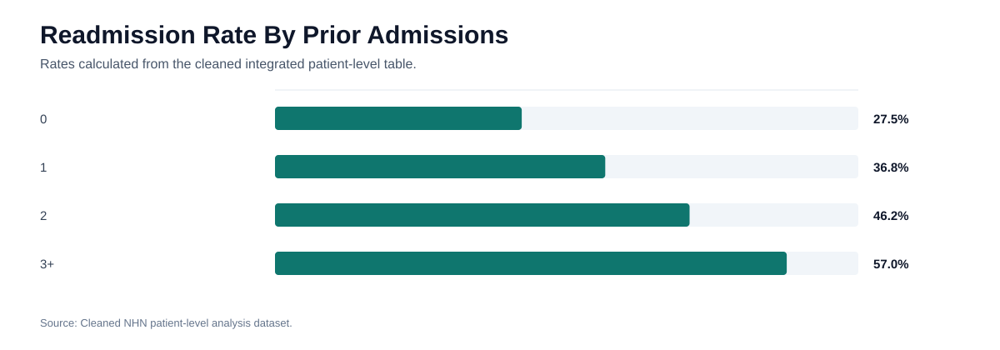
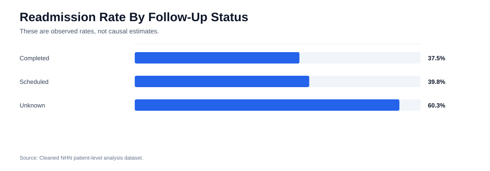

# Exploratory Data Analysis Report

## Executive Summary

The cleaned integrated dataset contains 12,000 matched patient records across the patient readmission, financial impact, and care coordination datasets. The analytical sample readmission rate is 43.2%. The strongest descriptive readmission patterns appear in chronic condition burden, prior admissions, age, emergency admission type, skilled nursing discharge, and missing follow-up status.

## Data Sources

| Dataset | Role |
| --- | --- |
| Patient Readmission Dataset | Clinical and utilization variables plus readmission outcome |
| Financial Impact Dataset | Readmission cost, reimbursement, penalty, and total care cost fields |
| Care Coordination Dataset | Post-discharge support and intervention fields |

All three datasets contain 12,000 unique `patient_id` values and join completely.

## Data Quality Assessment

| dataset | issue | affected_rows | affected_rate |
| --- | --- | --- | --- |
| Patient | Missing follow-up status | 2,587 | 21.6% |
| Patient | Missing insurance type | 240 | 2.0% |
| Patient | Missing length of stay | 240 | 2.0% |
| Financial | Missing penalty cost | 240 | 2.0% |
| Financial | Missing follow-up program cost | 240 | 2.0% |
| Care Coordination | Missing follow-up days | 180 | 1.5% |
| Care Coordination | Missing post-discharge calls | 180 | 1.5% |
| Financial | Negative penalty cost | 49 | 0.4% |

The largest quality issue is missing follow-up status. Financial fields also include missing and negative values. The cleaning workflow preserves original values, adds quality flags, and creates analysis-ready companion fields.

## Overall Readmission Pattern

- Patients analyzed: 12,000
- Readmitted within 30 days: 5,184
- Readmission rate: 43.2%

## Segment Findings

| segment_type | segment | patient_count | readmission_rate | avg_total_care_cost |
| --- | --- | --- | --- | --- |
| Chronic condition bucket | 5+ | 1,317 | 62.3% | $25.26K |
| Follow-up status | Unknown | 2,587 | 60.3% | $25.29K |
| Prior admissions bucket | 3+ | 3,225 | 57.0% | $25.22K |
| Discharge disposition | Skilled Nursing | 1,803 | 54.4% | $25.03K |
| Age group | 85+ | 949 | 54.3% | $25.37K |
| Admission type | Emergency | 7,095 | 50.9% | $25.28K |
| ED visits bucket | 2 | 3,139 | 44.5% | $25.42K |
| Primary diagnosis | Heart Failure | 2,422 | 44.2% | $25.1K |

## Figures And Supporting Visuals

The following figures are generated from the cleaned project data and are included for report review and presentation reuse.

*Figure: Data quality issues by source dataset*

*Figure: Observed readmission rate by age group*

*Figure: Observed readmission rate by chronic condition burden*

*Figure: Observed readmission rate by prior admission count*

*Figure: Observed readmission rate by follow-up documentation status*

## Key Findings

1. Readmission risk increases materially with chronic condition burden.
2. Prior admissions show a clear relationship with readmission risk.
3. Older age groups carry higher observed readmission rates.
4. Emergency admissions have higher readmission rates than urgent or elective admissions.
5. Unknown follow-up status has the highest observed readmission rate among follow-up categories.
6. Financial data can support ROI planning, but final estimates should use quality flags and sensitivity checks.

## Areas For Further Investigation

- Validate whether missing follow-up status reflects actual lack of follow-up or documentation gaps.
- Compare interventions within high-risk deciles to determine whether care coordination reaches the right patients.
- Validate ROI assumptions with actual implementation costs.
- Review model threshold selection with clinical operations and care coordination capacity.

## Evidence Notes

- Record counts, readmission rates, data-quality rates, and segment tables are calculated from the cleaned and integrated NHN data [INT-3], [INT-4], [INT-5], [INT-6].
- The 30-day all-cause framing aligns with AHRQ HCUP readmission definitions and national readmission context [EXT-3].
- Segment relationships are descriptive. They should guide prioritization, not causal claims [EXT-4].

## References Used

Full reference governance is maintained in `REFERENCES.md` and `EVIDENCE_STANDARDS.md`.

- [INT-3] NHN Patient Readmission Dataset.csv and data/cleaned/patient_readmission_clean.csv.
- [INT-4] NHN Financial Impact Dataset.csv and data/cleaned/financial_impact_clean.csv.
- [INT-5] NHN Care Coordination Dataset.csv and data/cleaned/care_coordination_clean.csv.
- [INT-6] data/processed/nhn_patient_level_analysis.csv.
- [EXT-3] Elixhauser A, Steiner C. Readmissions to U.S. Hospitals by Diagnosis, 2010. HCUP Statistical Brief #153. AHRQ, 2013. https://hcup-us.ahrq.gov/reports/statbriefs/sb153.jsp
- [EXT-4] Jencks SF, Williams MV, Coleman EA. Rehospitalizations among patients in the Medicare fee-for-service program. N Engl J Med. 2009;360(14):1418-1428. doi:10.1056/NEJMsa0803563
