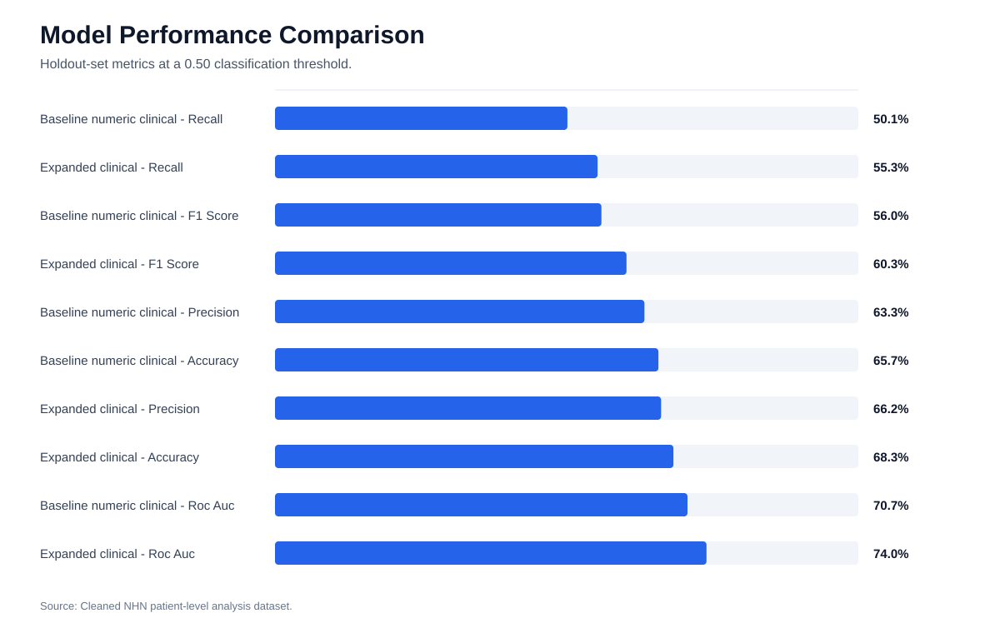
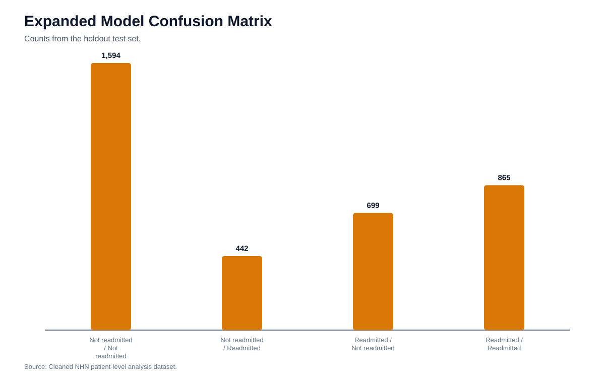
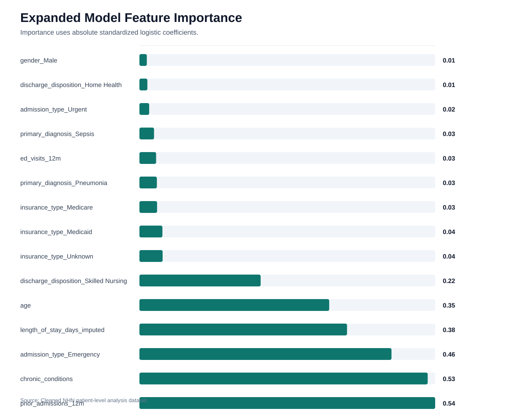
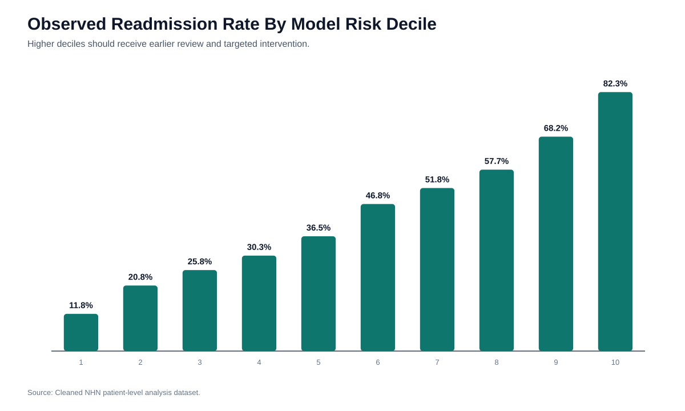

# Model Evaluation Report

## Modeling Objective

Identify patients at higher risk of 30-day readmission before discharge so NHN can prioritize discharge planning, care coordination, and follow-up resources.

## Target Variable

`readmitted_within_30_days`

- 1 = patient was readmitted within 30 days.
- 0 = patient was not readmitted within 30 days.

## Feature Set

The preliminary models use clinical and operational fields that are available before or around discharge. Financial outcomes were excluded from prediction because they represent downstream impact rather than pre-discharge risk.

## Models Compared

| model | accuracy | precision | recall | f1_score | roc_auc | predicted_positive_rate | test_records |
| --- | --- | --- | --- | --- | --- | --- | --- |
| Baseline numeric clinical logistic model | 65.7% | 63.3% | 50.1% | 56.0% | 0.71 | 34.4% | 3,600 |
| Expanded clinical logistic model | 68.3% | 66.2% | 55.3% | 60.3% | 0.74 | 36.3% | 3,600 |

## Selected Model

The expanded clinical logistic model is the current preferred planning model because it outperforms the numeric baseline and remains explainable for clinical leadership.

- Accuracy: 68.3%
- Precision: 66.2%
- Recall: 55.3%
- F1 score: 60.3%
- ROC-AUC: 0.74

## Confusion Matrix

| actual | predicted | count |
| --- | --- | --- |
| Not readmitted | Not readmitted | 1,594 |
| Not readmitted | Readmitted | 442 |
| Readmitted | Not readmitted | 699 |
| Readmitted | Readmitted | 865 |

## Feature Importance

| feature | coefficient | absolute_coefficient |
| --- | --- | --- |
| prior_admissions_12m | 0.54 | 0.54 |
| chronic_conditions | 0.53 | 0.53 |
| admission_type_Emergency | 0.46 | 0.46 |
| length_of_stay_days_imputed | 0.38 | 0.38 |
| age | 0.35 | 0.35 |
| discharge_disposition_Skilled Nursing | 0.22 | 0.22 |
| insurance_type_Unknown | 0.04 | 0.04 |
| insurance_type_Medicaid | 0.04 | 0.04 |
| insurance_type_Medicare | 0.03 | 0.03 |
| primary_diagnosis_Pneumonia | 0.03 | 0.03 |
| ed_visits_12m | 0.03 | 0.03 |
| primary_diagnosis_Sepsis | 0.03 | 0.03 |

## Risk Decile Validation

| risk_decile | patient_count | average_risk_score | readmission_rate |
| --- | --- | --- | --- |
| 1 | 1,200 | 0.11 | 11.8% |
| 2 | 1,200 | 0.19 | 20.8% |
| 3 | 1,200 | 0.26 | 25.8% |
| 4 | 1,200 | 0.32 | 30.3% |
| 5 | 1,200 | 0.38 | 36.5% |
| 6 | 1,200 | 0.44 | 46.8% |
| 7 | 1,200 | 0.51 | 51.8% |
| 8 | 1,200 | 0.59 | 57.7% |
| 9 | 1,200 | 0.69 | 68.2% |
| 10 | 1,200 | 0.82 | 82.3% |

The decile table shows that the model separates lower-risk and higher-risk patients well enough for planning and prioritization.

## Figures And Supporting Visuals

The following figures are generated from the cleaned project data and are included for report review and presentation reuse.

*Figure: Baseline versus expanded model performance*

*Figure: Expanded clinical model confusion matrix*

*Figure: Top drivers in the expanded clinical model*

*Figure: Observed readmission rate by model risk decile*

## Limitations

- This is a preliminary model built from the supplied project dataset.
- The model requires validation before clinical production use.
- The 0.50 threshold may not be the best operational threshold. NHN should choose a threshold based on clinical capacity, acceptable false positives, and the cost of missing high-risk patients.
- The current model does not include facility-level, time-based, medication, lab, or social determinant variables that could improve performance.

## Operational Recommendation

Use the model initially for risk stratification, discharge planning prioritization, and dashboard reporting. NHN should pilot the score with care coordination teams before using it for automated decisions.

## Evidence Notes

- Model metrics, confusion matrix counts, feature coefficients, and risk decile validation are generated from the supplied project dataset and section modeling outputs [INT-6].
- Model results are planning evidence. TRIPOD guidance supports transparent reporting, validation caveats, and careful interpretation before production use [EXT-7], [EXT-8].
- The selected workflow should combine model score, clinical rules, and care team review instead of using one score as the sole decision engine [EXT-7].

## References Used

Full reference governance is maintained in `REFERENCES.md` and `EVIDENCE_STANDARDS.md`.

- [INT-6] data/processed/nhn_patient_level_analysis.csv.
- [EXT-7] Collins GS, Reitsma JB, Altman DG, Moons KGM. Transparent Reporting of a multivariable prediction model for Individual Prognosis or Diagnosis (TRIPOD): the TRIPOD statement. Ann Intern Med. 2015;162(1):55-63. doi:10.7326/M14-0697
- [EXT-8] TRIPOD Statement. TRIPOD+AI and TRIPOD 2015 resources. https://www.tripod-statement.org/
