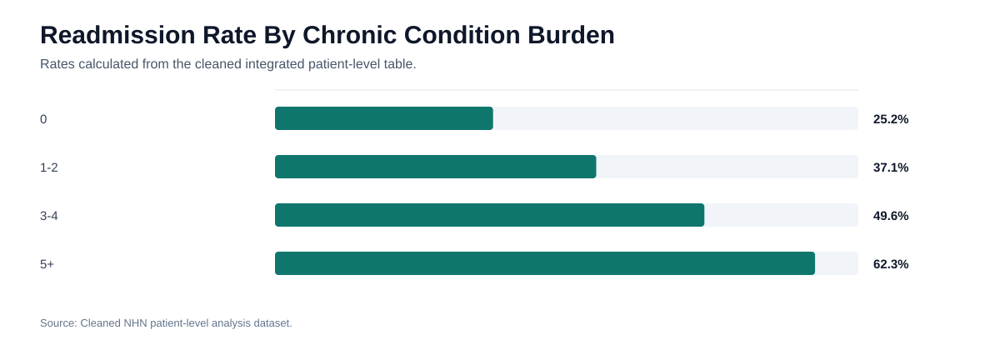
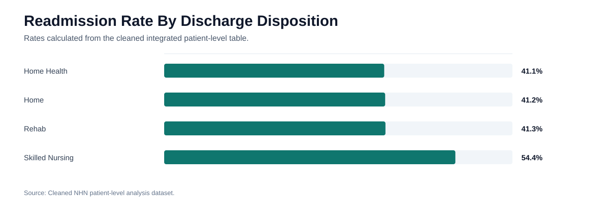
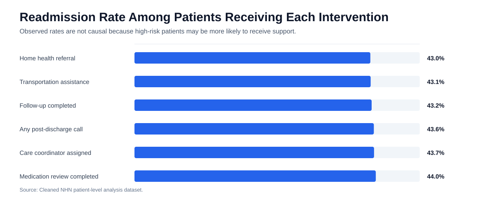
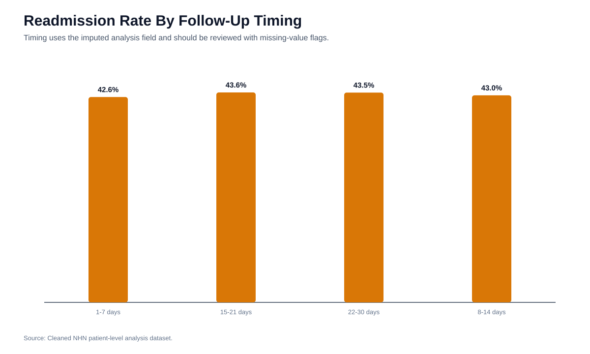

# Clinical And Care Coordination Analysis Report

## Executive Summary

The clinical analysis identifies higher readmission risk among older patients, patients with more chronic conditions, patients with repeated prior admissions, emergency admissions, skilled nursing discharges, and patients with unknown follow-up status. Care coordination activity requires cautious interpretation because high-risk patients may receive more support.

## High-Risk Clinical Segments

| segment_type | segment | patient_count | readmission_rate | avg_total_care_cost |
| --- | --- | --- | --- | --- |
| Chronic condition bucket | 5+ | 1,317 | 62.3% | $25.26K |
| Follow-up status | Unknown | 2,587 | 60.3% | $25.29K |
| Prior admissions bucket | 3+ | 3,225 | 57.0% | $25.22K |
| Discharge disposition | Skilled Nursing | 1,803 | 54.4% | $25.03K |
| Age group | 85+ | 949 | 54.3% | $25.37K |
| Age group | 75-84 | 1,491 | 51.1% | $25.25K |
| Admission type | Emergency | 7,095 | 50.9% | $25.28K |
| Chronic condition bucket | 3-4 | 4,181 | 49.6% | $25.18K |
| Age group | 65-74 | 2,393 | 48.0% | $25.28K |
| Prior admissions bucket | 2 | 3,206 | 46.2% | $25.1K |
| Age group | 50-64 | 4,065 | 42.0% | $25.17K |
| Discharge disposition | Rehab | 1,247 | 41.3% | $25.43K |
| Discharge disposition | Home | 7,404 | 41.2% | $25.25K |
| Discharge disposition | Home Health | 1,546 | 41.1% | $25.45K |
| Follow-up status | Scheduled | 4,120 | 39.8% | $25.25K |

## Care Coordination Intervention Summary

| intervention | patients_with_intervention | readmission_rate_with_intervention | readmission_rate_without_intervention | observed_difference_pp |
| --- | --- | --- | --- | --- |
| Home health referral | 3,635 | 43.0% | 43.3% | -0.3% |
| Transportation assistance | 1,728 | 43.1% | 43.2% | -0.2% |
| Follow-up completed | 8,354 | 43.2% | 43.1% | 0.1% |
| Any post-discharge call | 10,021 | 43.6% | 41.0% | 2.7% |
| Care coordinator assigned | 7,758 | 43.7% | 42.3% | 1.3% |
| Medication review completed | 9,026 | 44.0% | 40.8% | 3.2% |

## Intervention Count Summary

| intervention_count | patient_count | readmission_rate |
| --- | --- | --- |
| 0 | 24 | 20.8% |
| 1 | 393 | 43.3% |
| 2 | 1,891 | 40.9% |
| 3 | 4,152 | 42.9% |
| 4 | 3,951 | 43.9% |
| 5 | 1,447 | 46.2% |
| 6 | 142 | 36.6% |

## Follow-Up Timing Summary

| follow_up_timing_bucket | patient_count | readmission_rate |
| --- | --- | --- |
| 1-7 days | 2,750 | 42.6% |
| 15-21 days | 2,947 | 43.6% |
| 22-30 days | 3,459 | 43.5% |
| 8-14 days | 2,844 | 43.0% |

## Figures And Supporting Visuals

The following figures are generated from the cleaned project data and are included for report review and presentation reuse.

*Figure: Readmission rate by chronic condition burden*

*Figure: Readmission rate by prior admission count*

*Figure: Readmission rate by discharge disposition*

*Figure: Observed intervention association by intervention type*

*Figure: Readmission rate by follow-up timing bucket*

## Interpretation

The most useful care coordination insight is not that one intervention clearly causes lower readmissions. The dataset suggests that NHN should evaluate whether interventions are assigned consistently to the patients with the greatest predicted risk. Several raw intervention groups have similar or higher readmission rates, which likely reflects patient selection and baseline risk.

## Recommendations

1. Prioritize enhanced discharge planning for patients with high chronic condition burden or repeated prior admissions.
2. Use the risk score to trigger care coordination review before discharge.
3. Treat unknown follow-up status as an operational defect and close documentation gaps.
4. Evaluate intervention effectiveness inside risk bands, especially the top three risk deciles.
5. Track follow-up completion, medication review, home health referral, transportation assistance, and post-discharge calls in the executive dashboard.

## Required Caveat

The current care coordination analysis shows observed association. It does not prove that an intervention caused or prevented readmission.

## Evidence Notes

- Clinical segment rates, intervention comparisons, intervention counts, and follow-up timing rates are calculated from the integrated NHN patient-level analysis and care coordination data [INT-3], [INT-5], [INT-6].
- Care transition and discharge redesign recommendations are supported by randomized evidence for structured transition support and reengineered discharge workflows [EXT-5], [EXT-6].
- The current intervention comparisons remain observational. Selection bias is a material limitation, so the report recommends redesigning targeting and timing rather than claiming causal effects.

## References Used

Full reference governance is maintained in `REFERENCES.md` and `EVIDENCE_STANDARDS.md`.

- [INT-3] NHN Patient Readmission Dataset.csv and data/cleaned/patient_readmission_clean.csv.
- [INT-5] NHN Care Coordination Dataset.csv and data/cleaned/care_coordination_clean.csv.
- [INT-6] data/processed/nhn_patient_level_analysis.csv.
- [EXT-5] Coleman EA, Parry C, Chalmers S, Min SJ. The care transitions intervention: results of a randomized controlled trial. Arch Intern Med. 2006;166(17):1822-1828. doi:10.1001/archinte.166.17.1822
- [EXT-6] Jack BW, Chetty VK, Anthony D, et al. A reengineered hospital discharge program to decrease rehospitalization: a randomized trial. Ann Intern Med. 2009;150(3):178-187. doi:10.7326/0003-4819-150-3-200902030-00007
- [EXT-7] Collins GS, Reitsma JB, Altman DG, Moons KGM. Transparent Reporting of a multivariable prediction model for Individual Prognosis or Diagnosis (TRIPOD): the TRIPOD statement. Ann Intern Med. 2015;162(1):55-63. doi:10.7326/M14-0697
