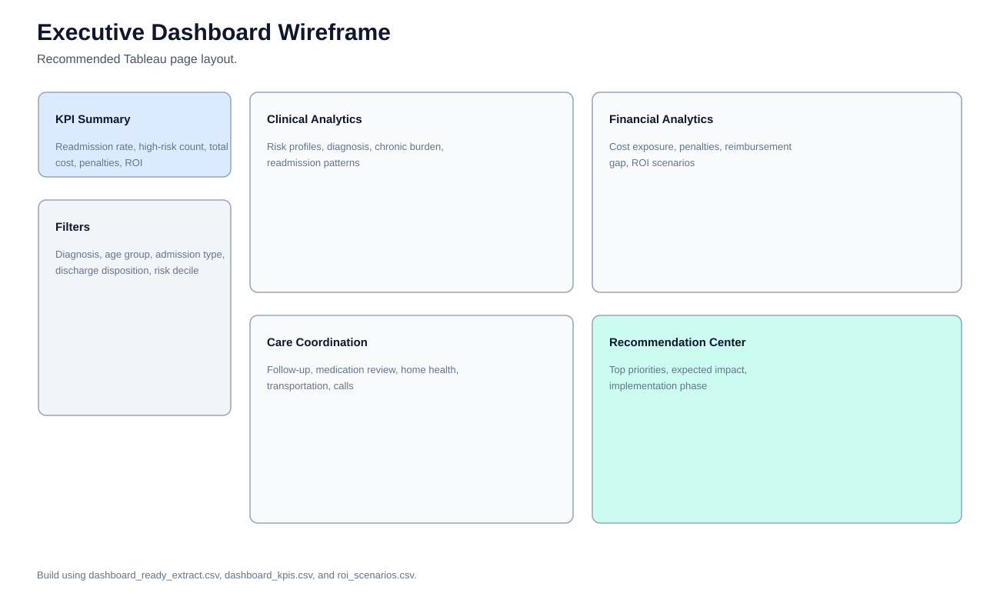
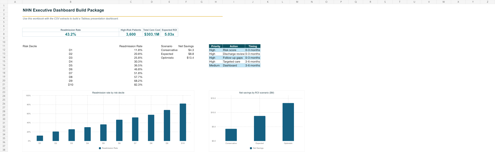
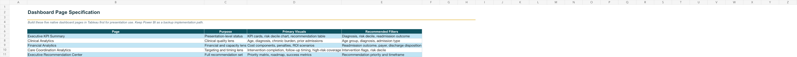
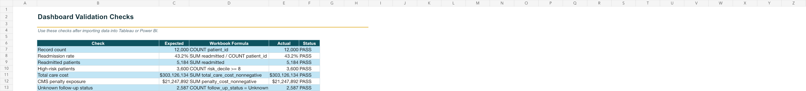

# Executive Dashboard Specification

## Dashboard Tool

Use Tableau first for the required executive dashboard. This repository includes the dashboard-ready data, KPI definitions, and page specifications needed to build the native Tableau dashboard file.

## Required Data Files

- `sections/08_executive_dashboard_walkthrough/data/dashboard_ready_extract.csv`
- `sections/08_executive_dashboard_walkthrough/data/dashboard_kpis.csv`
- `sections/08_executive_dashboard_walkthrough/data/dashboard_measure_definitions.csv`
- `sections/10_financial_impact_and_roi_analysis/data/roi_scenarios.csv`

## Page 1: Executive KPI Summary

KPI cards:

- Readmission Rate
- High-Risk Patients
- Total Care Cost
- CMS Penalties
- Expected ROI
- Average Risk Score

Recommended visuals:

- KPI card row.
- Readmission by risk decile.
- Recommendation summary table.

## Page 2: Clinical Analytics

Recommended visuals:

- Readmission rate by age group.
- Readmission rate by diagnosis.
- Readmission rate by chronic condition bucket.
- Readmission rate by prior admissions bucket.
- Readmission rate by discharge disposition.

## Page 3: Financial Analytics

Recommended visuals:

- Total care cost by readmission outcome.
- Cost component totals.
- Net reimbursement gap by discharge disposition.
- ROI scenario chart.

## Page 4: Care Coordination Analytics

Recommended visuals:

- Readmission rate by intervention.
- Intervention count distribution.
- Follow-up timing readmission rate.
- Intervention completion KPI cards.

## Page 5: Executive Recommendation Center

Recommended visuals:

- Recommendation priority matrix.
- Implementation roadmap.
- Success metrics table.

## Figures And Supporting Visuals

The following figures are generated from the cleaned project data and are included for report review and presentation reuse.

*Figure: Recommended Tableau dashboard page layout*

*Figure: Dashboard build package summary preview*

*Figure: Dashboard page specification preview*

*Figure: Dashboard validation checks preview*

## Suggested Calculated Measures

| Measure | Definition |
| --- | --- |
| Readmission Rate | `SUM(readmitted_within_30_days) / COUNT(patient_id)` |
| High-Risk Patients | Count of patients with `risk_decile` equal to 8, 9, or 10 |
| Total Care Cost | `SUM(total_care_cost_nonnegative)` |
| CMS Penalties | `SUM(penalty_cost_nonnegative)` |
| Average Risk Score | `AVG(preliminary_readmission_risk_score)` |
| Intervention Completion Rate | Average of the selected binary intervention field |

## Recommended Filters

- Primary diagnosis.
- Age group.
- Admission type.
- Discharge disposition.
- Insurance type.
- Risk decile.
- Readmission outcome.
- Data quality issue flag.

## Validation Checklist

- Confirm record count equals 12,000.
- Confirm readmission rate equals 43.2%.
- Confirm high-risk filters use risk deciles 8 through 10.
- Confirm financial charts use nonnegative financial fields.
- Confirm care coordination pages include the selection-bias caveat in dashboard notes or presentation narration.

## Evidence Notes

- Dashboard data files are derived from the integrated patient-level analysis table and section-level summaries [INT-6].
- The dashboard is required by the final presentation guide and should be built in Tableau first based on team preference [INT-2].
- Model and care coordination views should preserve validation and association caveats [EXT-5], [EXT-6], [EXT-7].

## References Used

Full reference governance is maintained in `REFERENCES.md` and `EVIDENCE_STANDARDS.md`.

- [INT-2] Option 1 Final Presentation Requirements.pdf.
- [INT-6] data/processed/nhn_patient_level_analysis.csv.
- [EXT-1] Centers for Medicare & Medicaid Services. Hospital Readmissions Reduction Program. https://www.cms.gov/medicare/quality/value-based-programs/hospital-readmissions-reduction-program
- [EXT-3] Elixhauser A, Steiner C. Readmissions to U.S. Hospitals by Diagnosis, 2010. HCUP Statistical Brief #153. AHRQ, 2013. https://hcup-us.ahrq.gov/reports/statbriefs/sb153.jsp
- [EXT-5] Coleman EA, Parry C, Chalmers S, Min SJ. The care transitions intervention: results of a randomized controlled trial. Arch Intern Med. 2006;166(17):1822-1828. doi:10.1001/archinte.166.17.1822
- [EXT-6] Jack BW, Chetty VK, Anthony D, et al. A reengineered hospital discharge program to decrease rehospitalization: a randomized trial. Ann Intern Med. 2009;150(3):178-187. doi:10.7326/0003-4819-150-3-200902030-00007
- [EXT-7] Collins GS, Reitsma JB, Altman DG, Moons KGM. Transparent Reporting of a multivariable prediction model for Individual Prognosis or Diagnosis (TRIPOD): the TRIPOD statement. Ann Intern Med. 2015;162(1):55-63. doi:10.7326/M14-0697
